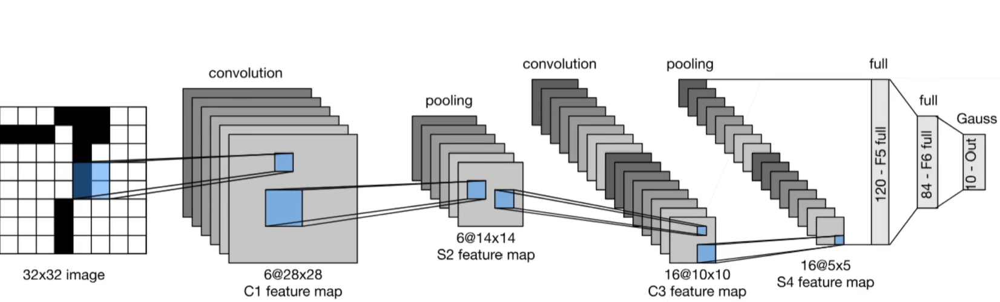

# LeNet

背景 手写数字识别
MINST 数据集



先使用卷积层学习图片空间信息
然后使用全连接层来转换到类别空间

```python
import torch
from torch import nn
from d2l import torch as d2l

net = nn.Sequential(
    nn.Conv2d(1, 6, kernel_size=5, padding=2), nn.Sigmoid(),
    //第一个卷积（输入，输出，核大小，填充）
    nn.AvgPool2d(kernel_size=2, stride=2),
    //第一个池化（核大小，步长）
    nn.Conv2d(6, 16, kernel_size=5), nn.Sigmoid(),
    //第二个卷积
    nn.AvgPool2d(kernel_size=2, stride=2),
    //第二个池化
    nn.Flatten(),
    //降维
    nn.Linear(16 * 5 * 5, 120), nn.Sigmoid(),
    nn.Linear(120, 84), nn.Sigmoid(),
    nn.Linear(84, 10))
```

