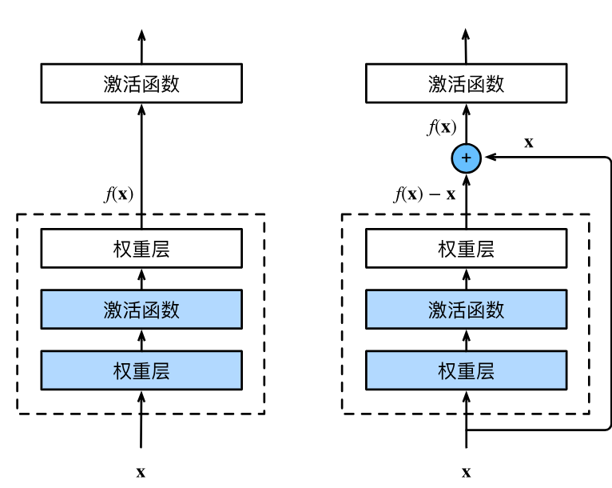

# ResNet 残差网络

## Lead-in

加更多层不一定总是改进精度

## 残差块

- 串联一个层改变函数类，我们希望能扩大函数类
- 残差块加入快速通道得到
  $f(x)=x+g(x)$的结构

（从VGG来的）

## ResNet块

- 高宽减半ResNet块 （步幅2）
- 后接多个高宽不变ResNet块



类似VGG和GoogLeNet的总体架构，替换成ResNet块

```python
class Residual(nn.Module):  #@save
    def __init__(self, input_channels, num_channels,
                 use_1x1conv=False, strides=1):
        super().__init__()
        self.conv1 = nn.Conv2d(input_channels, num_channels,
                               kernel_size=3, padding=1, stride=strides)
        self.conv2 = nn.Conv2d(num_channels, num_channels,
                               kernel_size=3, padding=1)
        if use_1x1conv:
            self.conv3 = nn.Conv2d(input_channels, num_channels,
                                   kernel_size=1, stride=strides)
        else:
            self.conv3 = None
        self.bn1 = nn.BatchNorm2d(num_channels)
        self.bn2 = nn.BatchNorm2d(num_channels)

    def forward(self, X):
        Y = F.relu(self.bn1(self.conv1(X)))
        Y = self.bn2(self.conv2(Y))
        if self.conv3:
            X = self.conv3(X)
        Y += X
        return F.relu(Y)
```


使得很深的网络更加容易训练
残差网络对随后的深层神经网络设计产生了深远影响，无论是卷积类网络还是全连接类网络


## 咋做到的呢

